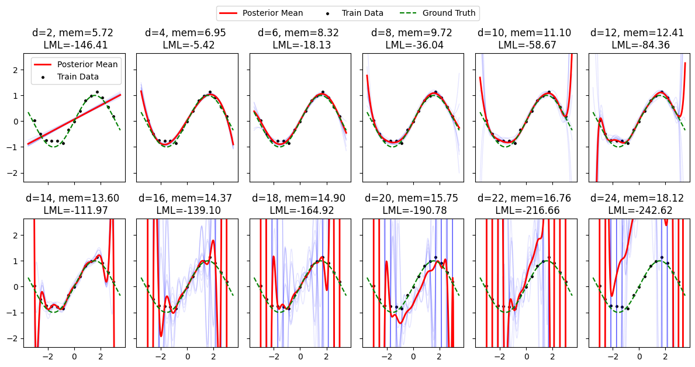
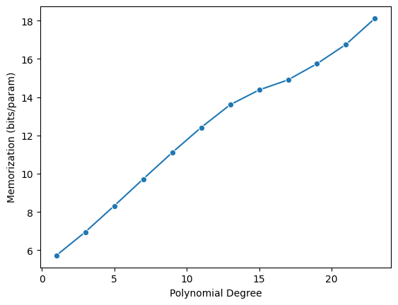
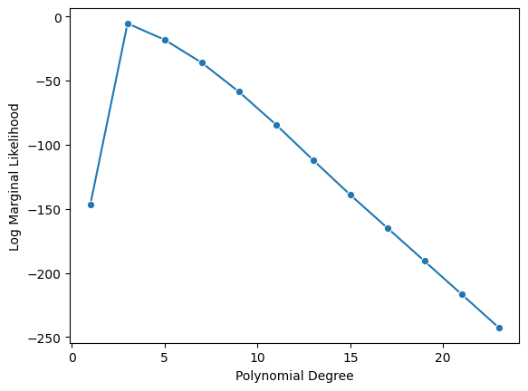
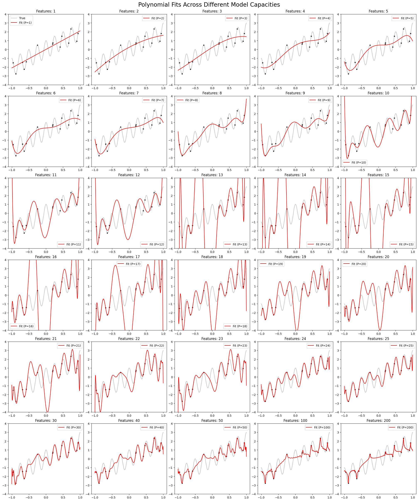
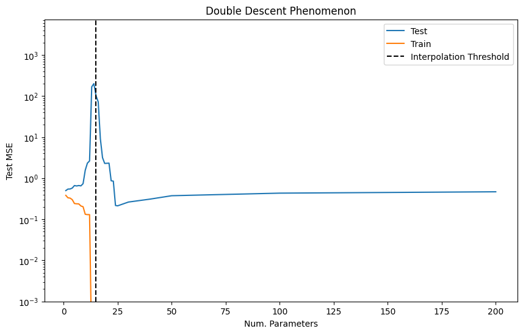
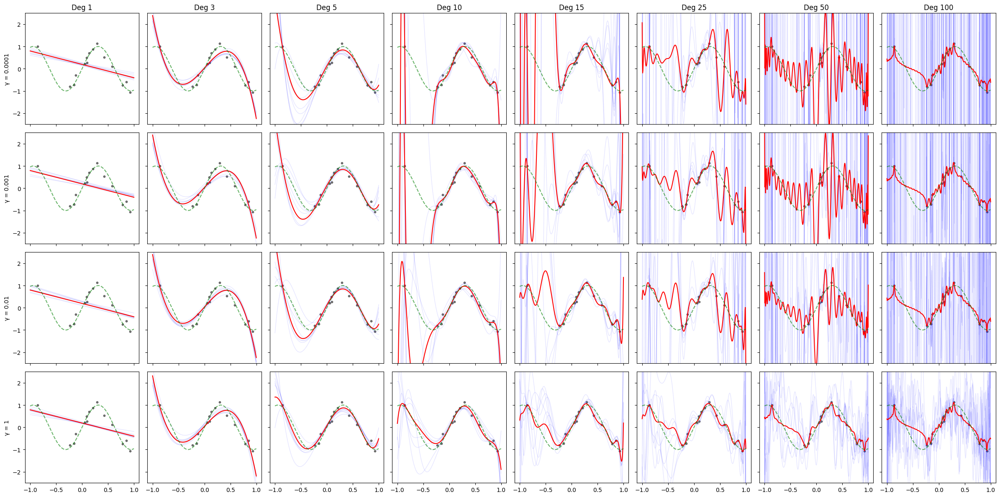
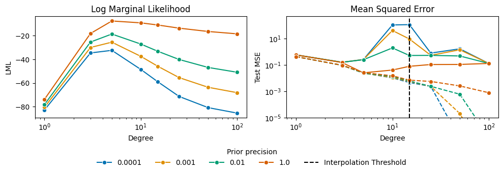

This notebook explores the double descent phenomenon through the lens of Bayesian linear regression. It demonstrates how model complexity affects generalization by comparing polynomial and Legendre basis expansions.

```python
import warnings
warnings.filterwarnings('ignore')
import numpy as np
import matplotlib.pyplot as plt
import seaborn as sns
from scipy.stats import multivariate_normal
from sklearn import datasets, linear_model
from sklearn.metrics import mean_squared_error
import scipy
import pandas as pd
np.random.seed(0)

# Function to generate sinusoidal dataset
def generate_data(N, noise_std=0.5):
    x = np.linspace(-3, 3, N)
    y_true = np.sin(x)
    y = y_true + np.random.normal(0, noise_std, size=N)
    return x, y, y_true

# Basis function expansion
def basis_expansion(x, basis='linear', poly_degree=3):
    if basis == 'linear':
        return np.vstack((np.ones_like(x), x)).T
    elif basis == 'polynomial':
        return np.vstack([x**i for i in range(poly_degree + 1)]).T
    elif basis == 'legendre':
        degrees = np.arange(poly_degree + 1)
        return scipy.special.eval_legendre(degrees[:, None], x).T
    else:
        raise ValueError("Unknown basis")

# Compute MLE for linear regression
def compute_mle(X, y):
    return np.linalg.inv(X.T @ X) @ X.T @ y

# Draw samples from prior
def draw_prior_samples(prior_mean, prior_cov, num_samples=5):
    return np.random.multivariate_normal(prior_mean, prior_cov, num_samples)
```


```python
def blr(N=100, gamma=1, basis='polynomial', sigma=0.1):
    # 1. Data Generation and Masking
    x, y, y_true = generate_data(N, noise_std=sigma)
    #mask = ~(((x >= 0) & (x <= 3)) | ((x >= -4) & (x <= -3)) | ((x >= -2.5) & (x <= -1)))
    #x, y, y_true = x[mask], y[mask], y_true[mask]
    
    fig, axs = plt.subplots(2, 6, figsize=(12, 6), sharey=True, sharex=True)
    axs = axs.flatten()
    logML_values = []
    mem_values = []

    degrees = [1,3,5,7,9,11,13,15,17,19,21,23]  # Polynomial degrees to evaluate
    
    for i, degree in enumerate(degrees):
        ax = axs[i]
        X = basis_expansion(x, basis=basis, poly_degree=degree)
        n, d = X.shape # n: datapoints, d: parameters
        
        # 2. Prior and Posterior 
        # Prior: p(theta) = N(0, (1/gamma)*I)
        S0_inv = gamma * np.eye(d)
        
        # Posterior covariance Sn: inverse of precision matrix
        # Precision = Prior_Precision + (sigma^-2 * X.T @ X)
        jitter = 1e-9 * np.eye(d)
        Sn_inv = S0_inv + (sigma**-2) * X.T @ X + jitter
        Sn = np.linalg.inv(Sn_inv)
        mn = Sn @ (sigma**-2 * X.T @ y)
        
        # 3. Stable Marginal Likelihood
        zn_cov = sigma**2 * np.eye(n) + 1/gamma * X @ X.T
        zn_cov += 1e-6 * np.eye(n)
        sign, log_det_cov = np.linalg.slogdet(zn_cov)
        sol = np.linalg.solve(zn_cov, y)
        quad_form = y.T @ sol
        log_ml = -n/2 * np.log(2*np.pi) - 0.5 * log_det_cov - 0.5 * quad_form 
        logML_values.append(log_ml)

        # 4. Total Memorization (bits) [cite: 96, 135]
        # mem = H(prior) - H(posterior)
        # For Gaussian: 0.5 * log2(|S0| / |Sn|) = 0.5 * log2(|Sn_inv| / |S0_inv|)
        _, log_det_S0_inv = np.linalg.slogdet(S0_inv)
        _, log_det_Sn_inv = np.linalg.slogdet(Sn_inv)
        total_mem = 0.5 * (log_det_Sn_inv - log_det_S0_inv) / np.log(2)
        bits_per_param = total_mem / d
        mem_values.append(bits_per_param)

        # 5. Visualization
        xtest = np.linspace(-3.5, 3.5, 200)
        Xtest = basis_expansion(xtest, basis=basis, poly_degree=degree)
        
        # Draws from the posterior to show generalization vs overfitting [cite: 5, 147]
        posterior_samples = np.random.multivariate_normal(mn, Sn, size=10)
        for j, w_post in enumerate(posterior_samples):
            ax.plot(xtest, Xtest @ w_post, color='blue', alpha=0.1, lw=1)

        ax.plot(xtest, Xtest @ mn, color='red', lw=2, label='Posterior Mean' if i==0 else None)
        sns.scatterplot(x=x, y=y, color='black', s=15, ax=ax, label='Train Data' if i==0 else None)
        ax.plot(xtest, np.sin(xtest), color='green', ls='--', label='Ground Truth' if i==0 else None)
        
        ax.set_ylim([np.min(y)-1.5, np.max(y)+1.5])
        ax.set_title(f'd={d}, mem={bits_per_param:.2f} \n LML={log_ml:.2f}', fontsize=12)

    fig.legend(loc='upper center', ncol=3, bbox_to_anchor=(0.5, 1.05))
    plt.tight_layout()
    plt.show()
    
    return logML_values, mem_values, degrees
```


```python
logML_values, mem_values, degrees = blr(N=15, gamma=1, basis='legendre', sigma=0.1)
```


    

    


```python
sns.lineplot(x=degrees, y=mem_values, marker='o')
plt.xlabel('Polynomial Degree')
plt.ylabel('Memorization (bits/param)')
plt.show()
```


    

    


```python
sns.lineplot(x=degrees, y=logML_values, marker='o')
plt.xlabel('Polynomial Degree')
plt.ylabel('Log Marginal Likelihood')  
plt.show()
```


    

    


## Double descent in polynomial regression


```python
def compute_y_from_x(X: np.ndarray):
    return np.add(2.0 * X, np.cos(X * 25))[:, 0]

low, high = -1.0, 1.0
num_data = 15
num_features_list = [1, 2, 3, 4, 5, 6, 7, 8, 9, 10, 11, 12, 13, 14, 15, 
                     16, 17, 18, 19, 20, 21, 22, 23, 24, 25, 30, 40, 50, 100, 200]

# Fixed training data for consistency across plots
np.random.seed(42) 
X_train = np.random.uniform(low=low, high=high, size=(num_data, 1))
y_train = compute_y_from_x(X_train)

X_test = np.linspace(start=low, stop=high, num=1000).reshape(-1, 1)
y_test = compute_y_from_x(X_test)

mse_list = []
preds_list = [] # Store predictions for subplots

# --- Computations ---
for num_features in num_features_list:
    feature_degrees = 1 + np.arange(num_features).astype(int)
    
    # Fit using Legendre Polynomials
    X_train_poly = scipy.special.eval_legendre(feature_degrees, X_train)
    X_test_poly = scipy.special.eval_legendre(feature_degrees, X_test)
    #X_train_poly = np.vander(X_train.flatten(), num_features + 1, increasing=True)[:, 1:]
    #X_test_poly = np.vander(X_test.flatten(), num_features + 1, increasing=True)[:, 1:]
    
    # Solve via Moore-Penrose pseudoinverse
    beta_hat = np.linalg.pinv(X_train_poly) @ y_train
    
    y_train_pred = X_train_poly @ beta_hat
    y_test_pred = X_test_poly @ beta_hat
    
    mse_list.append({
        "Num. Parameters": num_features,
        "Train MSE": mean_squared_error(y_train, y_train_pred),
        "Test MSE": mean_squared_error(y_test, y_test_pred),
    })
    preds_list.append(y_test_pred)

# --- Visualization: Subplot Grid ---
n_plots = len(num_features_list)
cols = 5
rows = (n_plots // cols) + (1 if n_plots % cols != 0 else 0)

fig, axes = plt.subplots(rows, cols, figsize=(20, 4 * rows), constrained_layout=True)
axes = axes.flatten()

for i, num_features in enumerate(num_features_list):
    ax = axes[i]
    sns.lineplot(x=X_test[:, 0], y=y_test, ax=ax, color='gray', alpha=0.5, label="True" if i==0 else None)
    sns.lineplot(x=X_test[:, 0], y=preds_list[i], ax=ax, color='red', label=f"Fit (P={num_features})")
    sns.scatterplot(x=X_train[:, 0], y=y_train, ax=ax, s=20, color='black', edgecolor='white')
    
    ax.set_ylim(-4, 4)
    ax.set_title(f"Features: {num_features}")
    if i % cols != 0: ax.set_ylabel("")
    if i < (n_plots - cols): ax.set_xlabel("")

# Hide unused subplots
for j in range(i + 1, len(axes)):
    axes[j].axis('off')

plt.suptitle("Polynomial Fits Across Different Model Capacities", fontsize=20)
plt.show()

# --- Visualization: MSE Curves ---
mse_df = pd.DataFrame(mse_list)
plt.figure(figsize=(10, 6))
sns.lineplot(data=mse_df, x="Num. Parameters", y="Test MSE", label="Test")
sns.lineplot(data=mse_df, x="Num. Parameters", y="Train MSE", label="Train")
plt.axvline(x=num_data, color="black", linestyle="--", label="Interpolation Threshold")
plt.yscale("log")
plt.ylim(bottom=1e-3)
plt.title("Double Descent Phenomenon")
plt.legend()
plt.show()
```


    

    


    

    


```python
np.random.seed(0)

def generate_data(N, noise_std=0.5):
    x = np.sort(np.random.uniform(-1, 1, size=N))
    y_true = np.sin(x * 5)
    y = y_true + np.random.normal(0, noise_std, size=N)
    return x, y, y_true

def basis_expansion(x, basis='legendre', poly_degree=3):
    if basis == 'linear':
        return np.vstack((np.ones_like(x), x)).T
    elif basis == 'polynomial':
        # Using Vandermonde: [x^0, x^1, ..., x^d]
        return np.vander(x, poly_degree + 1, increasing=True)
    elif basis == 'legendre':
        # Correctly evaluate Legendre polynomials for each degree
        X = np.zeros((len(x), poly_degree + 1))
        for d in range(poly_degree + 1):
            X[:, d] = scipy.special.eval_legendre(d, x)
        return X
    else:
        raise ValueError("Unknown basis")

def blr_grid_analysis(N=15, sigma=0.2, basis='legendre'):
    x, y, y_true = generate_data(N, noise_std=sigma)
    degrees = [1, 3, 5, 10, 15, 25, 50, 100]
    gammas = [1e-4, 1e-3, 1e-2, 1]
    
    # Grid Plot Setup
    fig, axes = plt.subplots(len(gammas), len(degrees), figsize=(24, 12), sharex=True, sharey=True)
    
    results = []
    xtest = np.linspace(-1, 1, 400)
    ytest_true = np.sin(xtest * 5)

    for r, gamma in enumerate(gammas):
        for c, degree in enumerate(degrees):
            ax = axes[r, c]
            
            # Expansion
            X = basis_expansion(x, basis=basis, poly_degree=degree)
            Xtest = basis_expansion(xtest, basis=basis, poly_degree=degree)
            n, d = X.shape 
            
            # Posterior
            S0_inv = gamma * np.eye(d)
            Sn_inv = S0_inv + (sigma**-2) * (X.T @ X)
            Sn = np.linalg.inv(Sn_inv)
            mn = Sn @ (sigma**-2 * X.T @ y)
            
            # --- Metrics ---
            y_train_pred = X @ mn
            y_test_pred = Xtest @ mn
            train_mse = mean_squared_error(y, y_train_pred)
            test_mse = mean_squared_error(ytest_true, y_test_pred)
            
            # Marginal Likelihood
            sse = np.sum((y - y_train_pred)**2)
            _, log_det_Sn_inv = np.linalg.slogdet(Sn_inv)
            log_ml = ((d/2) * np.log(gamma) - (n/2) * np.log(2 * np.pi) + n * np.log(1/sigma)
                      - 0.5 * log_det_Sn_inv - 0.5 * ((sigma**-2) * sse + gamma * (mn.T @ mn)))

            # Information Gain (KL Divergence)
            _, log_det_Sn = np.linalg.slogdet(Sn)
            log_det_S0 = -d * np.log(gamma)
            kl_div = 0.5 * (log_det_S0 - log_det_Sn + gamma * np.trace(Sn) + gamma * (mn.T @ mn) - d)
            bits_per_param = (kl_div / np.log(2)) / d

            results.append({
                "Gamma": gamma,
                "Degree": degree,
                "LML": log_ml,
                "Train MSE": train_mse,
                "Test MSE": test_mse,
                "Bits/Param": bits_per_param
            })

            # --- Plotting ---
            posterior_samples = np.random.multivariate_normal(mn, Sn, size=8)
            for w_post in posterior_samples:
                ax.plot(xtest, Xtest @ w_post, color='blue', alpha=0.1, lw=1)

            ax.plot(xtest, y_test_pred, color='red', lw=1.5)
            ax.scatter(x, y, color='black', s=10, alpha=0.5)
            ax.plot(xtest, ytest_true, color='green', ls='--', alpha=0.6)
            ax.set_ylim([-2.5, 2.5])
            
            if r == 0: ax.set_title(f'Deg {degree}')
            if c == 0: ax.set_ylabel(f'γ = {gamma}')

    plt.tight_layout()
    plt.show()
    df = pd.DataFrame(results) 
    return df

N = 15
results_df = blr_grid_analysis(N=N, sigma=0.2, basis='legendre')
```


    

    


```python
fig, (ax1, ax2) = plt.subplots(1, 2, figsize=(10, 3))
unique_gammas = results_df["Gamma"].nunique()
palette = sns.color_palette("colorblind", n_colors=unique_gammas)
# 1. Log Marginal Likelihood Plot
sns.lineplot(data=results_df, x="Degree", y="LML", hue="Gamma", marker="o", ax=ax1, palette=palette, legend=None)
ax1.set_title("Log Marginal Likelihood")
ax1.set_xscale("log")

# 2. Test MSE Plot (Double Descent)
sns.lineplot(data=results_df, x="Degree", y="Test MSE", hue="Gamma", marker="o", ax=ax2, palette=palette)
sns.lineplot(data=results_df, x="Degree", y="Train MSE", hue="Gamma", marker="o", linestyle='--', ax=ax2, palette=palette, legend=None)
ax2.set_title("Mean Squared Error")
ax2.set_yscale("log")
ax2.set_xscale("log")
ax2.set_ylim(bottom=1e-5)
ax2.axvline(x=N, color='black', linestyle='--', label='Interpolation Threshold')


handles, labels = ax2.get_legend_handles_labels()
ax2.get_legend().remove() # Remove the default legend from inside the plot

fig.legend(handles, labels, loc='lower center', title='Prior precision', ncol=len(labels), 
           bbox_to_anchor=(0.5, -0.15), frameon=False)

plt.tight_layout()
plt.show()
```


    

    

## References

[1] Schaeffer, Rylan, et al. "Double descent demystified: Identifying, interpreting & ablating the sources of a deep learning puzzle." arXiv preprint arXiv:2303.14151 (2023).